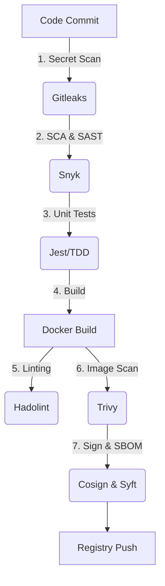

# Secure Full-Stack Application


[](https://nodejs.org/)
[](https://reactjs.org/)
[](https://snyk.io/)
[](https://owasp.org/)
[](https://docker.com)
[](https://opensource.org/licenses/Apache-2.0)

## 🛡️ Project Overview

This repository hosts a **Full-Stack Web Application (Node.js + React)** designed to showcase modern Software Engineering and DevOps practices.

<!--Originally developed as a vulnerability remediation capstone, this project has evolved to implement **SLSA (Supply-chain Levels for Software Artifacts)** principles, **Test-Driven Development (TDD)**, designed to showcase modern Software Engineering and DevOps practices. **GitHub Actions**.
-->

### Key Features

* **Automated Security Gates:** Builds fail if vulnerabilities or secrets are detected.
* **Container Security:** Image scanning, signing, and verification.<!--* **Observability:** Implementation of Software Bill of Materials (SBOM).-->
* **Legacy Remediation:** A documented case study of fixing critical CVEs.

---

## The DevOps Pipeline

I used GitHub Actions to enforce security checks at every stage of the lifecycle. The pipeline ensures that no insecure code is built or deployed.



### Tooling Strategy

| Stage |Tool |Purpose |
| :--- | :---: | :---: |
| 1. Secret Scanning | Gitleaks | Prevents hardcoded  credentials/secrets from entering the repo. |
| 2. SCA & SAST | Snyk |Scans dependencies and code logic for known vulnerabilities. |
| 3. Testing (TDD) |Jest + Supertest | Validates application logic and API endpoints before build. |
| 4. Docker Linting | Hadolint | Enforces best practices in Dockerfile construction. |
| 5. Container Scan |Trivy | Scans the built Docker image for OS-level vulnerabilities. |
| 6. Image Signing | Cosign | Cryptographically signs the image to guarantee integrity (SLSA). |
| 7. SBOM Generation | Syft | Generates a Software Bill of Materials (SPDX) for transparency. |

## 🔬 Case Study: Security Analysis & Vulnerability Remediation

 Context: This section documents the initial security audit performed on the legacy codebase as part of the Application Security for Developers certification.

### 1. The Problem (Initial Assessment)

Before remediation, the application was scanned using Snyk. The report revealed a critical security debt in the dependency tree.

**Common Vulnerabilities Detected:**

* **Cross-Site Scripting (XSS):** Detected in older frontend libraries.
* **Prototype Pollution:** Found in backend utility packages.
* **Arbitrary Code Execution:** Critical flaw in a deep dependency.

### 2. The Solution (Remediation Process)

I adopted a systematic approach to fix these issues:

1. **Direct Upgrades:** Updated `package.json` to move packages to safe versions suggested by Snyk.
2. **Patches:** Used `snyk wizard` to apply patches where upgrades were not immediately possible.
3. **Defensive Coding:** Refactored backend logic to validate input and sanitize headers (OWASP Top 10).

### 3. The Result (Final Status)

After applying the fixes and re-running the CI/CD pipeline checks:

| Severity | Initial Count | Current Count | Status |
| :--- | :---: | :---: | :--- |
| **Critical** | 27 | 0 | ✅ Fixed |
| **High** | 116 | 0 | ✅ Fixed |
| **Medium** | 191 | 2 |⚠️ Accepted Risk (Documented)|
| **Low** | 345 | 22 |ℹ️ Backlog |

#### Evidence of Remediation

| Initial Vulnerability Scan | Post-Fix Clean Scan |
|---|---|
|  |  |

## Local Development & Testing

### Prerequisites

* **Node.js v18+**
* **Docker**

### 1. Installation

```bash
git clone https://github.com/agslima/secure-app-analysis.git
cd secure-app-analysis
npm install
```

### 2. Running Tests (TDD)

This project follows Test-Driven Development. To ensure the application logic and security headers are functioning correctly:

```bash
# Run unit and integration tests
npm test

# Run tests in watch mode (for development)
npm run test:watch
```

To verify the current security status of the application, follow these steps:

### 3. Running the Security Audit

You need a Snyk account and CLI installed.

Download a standalone executable (for macOS, Linux, and Windows) of the Snyk CLI for your platform.

```bash
curl https://static.snyk.io/cli/latest/snyk-linux -o snyk
chmod +x ./snyk
mv ./snyk /usr/local/bin/
```

Authenticate your machine to associate it with your Snyk Account

```bash
# Authenticate
snyk auth

# Run the test
snyk test
```

### 4. Running the App

```bash
npm start
```

---

## Policy & Compliance

* **Security by Design:** Shifting security left in the SDLC.
* **Security Policy:** See SECURITY.md for reporting guidelines.
* **Verification:** Docker images pulled from this registry can be verified using the public key hosted in the repo.

## Tech Stack & Tools

* **Frontend:** React.js
* **Backend:** Node.js / Express
* **Security Analysis:** [Snyk](https://snyk.io) (Software Composition Analysis & SAST), Trivy, Gitleaks
* **Supply Chain:** Cosign, Syft
* **Monitoring (Concept):** Prometheus & Grafana methodologies

<!---
## License

This project is for educational purposes as part of the Coursera/IBM curriculum.
-->
